# AWS Lab 1 - Dynatraceオブザーバビリティ

## 概要

リホストやリアーキテクチャなど、適切な移行戦略を選択する際には、さまざまなリスク、コスト、メリットを考慮する必要があります。しかし、使用している技術スタックが何でどこで動いていて、どようなコンポーネントと連携しているかという詳細が不明であったり、文書化されていなかったりすることがよくあります。 存在するのは導入時に納品され更新されていないドキュメントといくつかの監視設定だけというケースです。

現在の環境について十分な情報がないため、いつ、何を移行するかを計画する際に、組織の正しい意思決定を妨げています。

この問題に対処するために、DynatraceのOneAgentは、アプリケーション・サービス・プロセスを自動的に検出し、アプリケーション環境全体の完全な依存関係マッピングを構築することができます。では、はじめましょう！

### 本セクションの目的

🔷 Dynatrace OneAgentの紹介

🔷 サンプルアプリケーションから取り込んだデータのリアルタイム確認

🔷 Dynatraceがモダナイゼーションプランニングにどのように役立つかを確認

### ハンズオン環境の確認

DynatraceのWeb UIを学び、Dynatrace OneAgentを通じてサンプルアプリケーションが動作するホストからアプリケーションまで一気通貫で情報が取得できることを確認します。

下の図は本セクションの環境の概要図になります。

**#1. サンプルアプリケーション**

このラボではDockerコンテナとして実装されたフロントエンドとバックエンドのシンプルなアーキテクチャで構成されたアプリケーションを利用します。

**#2. Dynatrace 環境**

Lab0のプロビジョニングスクリプト内でDynatrace OneAgentはホストにインストール済みです。データはすでに送られておりSaaS側では収集を開始しています。

### 💥 **TECHNICAL NOTE**

OneAgentのインストール方法の詳細は<a href="https://www.dynatrace.com/support/help/setup-and-configuration/dynatrace-oneagent" target="_blank">ドキュメント</a>をご確認ください。

**#3. JMeterプロセス**

バックグラウンドでトラフィックを生成するために<a href="https://github.com/dt-orders/load-traffic" target="_blank">JMeter</a> が動作しています。

### 💥 **TECHNICAL NOTE**:

実環境では、アプリケーションのコンポーネントがオンプレミスの物理または仮想マシン上で動作しており、「コンテナ化」されていない状態が多いでしょう。ワークショップを簡略化するために、アプリケーションをフロントエンドとバックエンドに「コンテナ化」しました。Dynatraceでは、これらのDockerコンテナはすべて、「コンテナ化されていない」アプリケーションと同様に、ホスト上の「プロセス」として表示されます。

## サンプルアプリ

Dynatrace Ordersというサンプルアプリケーションを使用します。詳細は<a href="https://github.com/dt-orders/overview" target="_blank">https://github.com/dt-orders/overview</a>を確認ください。全てのソースコードは<a href="https://github.com/dt-orders" target="_blank">https://github.com/dt-orders</a>にあります。

### サンプルアプリのパブリックIPアドレスの確認

パブリックIPアドレスを確認するためにAWSコンソールの`EC2インスタンス`ページにアクセスします。`dt-orders-monolith`インスタンスの詳細タブから`パブリックIPv4アドレス`を確認します。

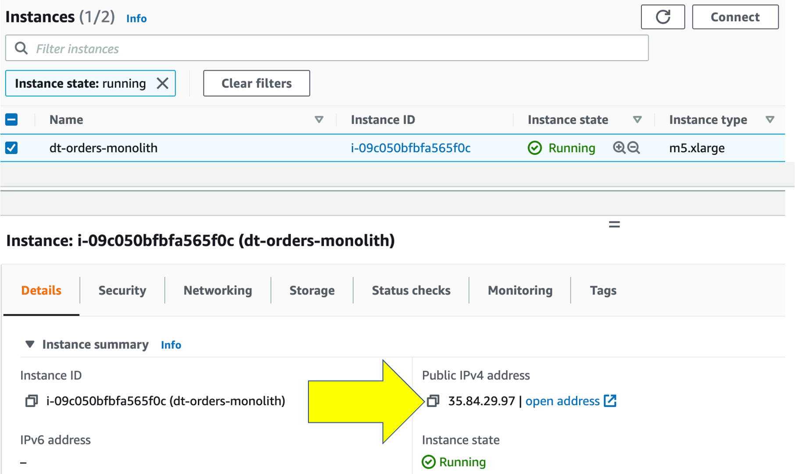

### サンプルアプリへのアクセス

アプリケーションを確認するためにパブリックIPアドレスをコピーして、アドレスバーに貼り付けます。このとき`HTTPS`ではなく`HTTP`でアクセスするようにしてください。

ホームページのメニューを使用してアプリケーションを移動し、主要な機能の URL を確認します。 これらのURLは、後でアプリケーションを分析するときに見ることになります。

* 顧客リスト = `customer/list.html`
* 顧客の詳細 - 顧客毎に専用ページ = `customer/5.html`
* カタログリスト = `catalog/list.html`
* カタログ検索フォーム = `catalog/searchForm.html`
* オーダーリスト = `order/list.html`
* オーダーフォーム = `order/form.html`

次のセクションでは、OneAgentが自動的に検出したホスト、サービス、プロセス、およびサンプル・アプリケーションの完全な依存関係マッピングを確認します。

## ホスト

まずは基本的なインフラ視点で確認をしていきましょう。ホストの監視といえばなんとなくイメージがつくかもしれませんが、そのイメージだけで十分でしょうか。Dynatraceではどのように見えるのか確認してみましょう。

### 👍 どのように役立つのか

クラウド移行を計画する際、これらのビューは、リソースの使用状況、他のシステムやサービスとの依存関係について洞察を与えてくれるでしょう。

### デプロイメントステータスの確認

サンプルアプリケーションを実行するホスト、サンプルアプリケーションのインストールとDynatrace OneAgentのインストールはスクリプトを使用して作成されています。 本ハンズオンではOneAgentをインストールする必要はないので、インストール後の状態を確認しておきましょう。

Dynatraceにログインしていない場合はログインをします。

### ホスト情報の確認

左のメニューバーから`インフラストラクチャ オブザーバビリティ > ホスト`を開き、`dt-orders-monolith`をクリックします。

ホストページでは、ホストのインフラに関する情報を確認することが可能です。

1. `Properties and tags`をクリックすることでホストの情報を確認できます。
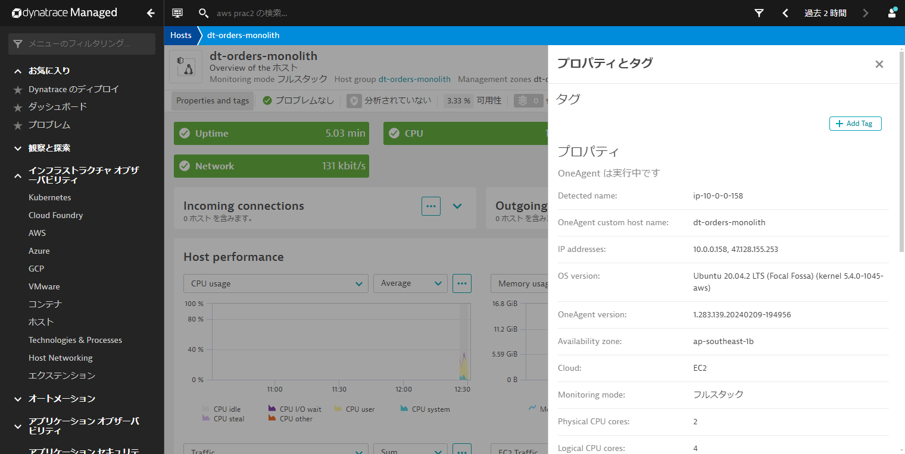

1. ホストのリソースに関するメトリック (CPU, memory, Traffic, システム負荷など)
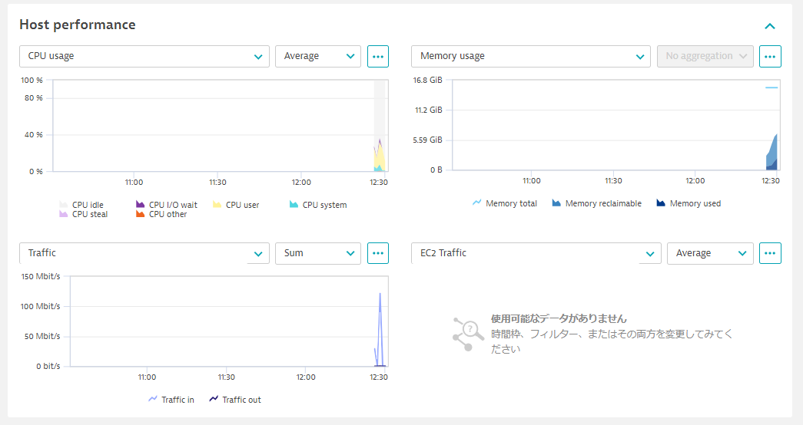

1. 実行プロセスの確認。サンプルアプリはNodejsとJavaをベースにしています。
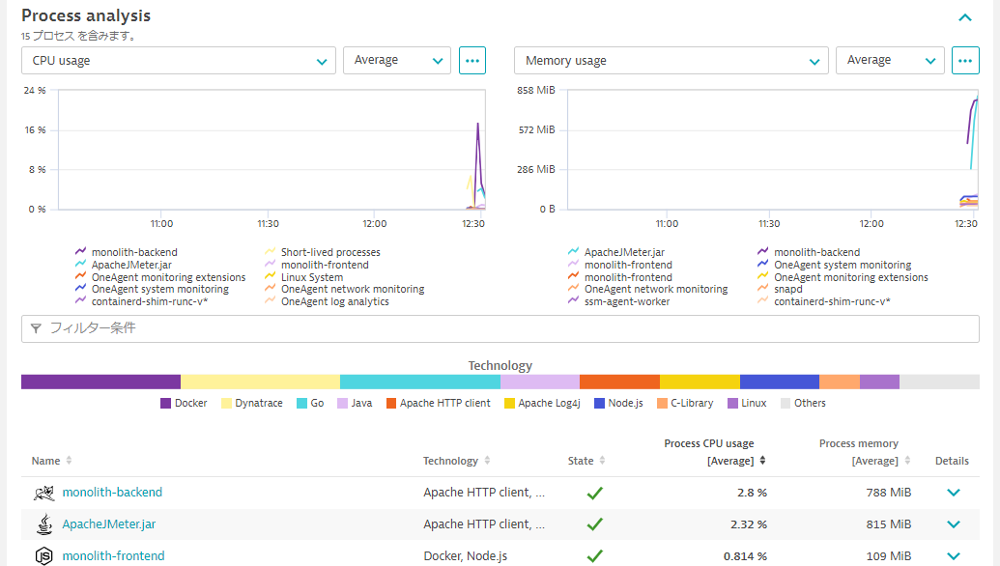

1. 下にスクロールすることでさらにDiskやネットワークなどの詳細情報を1つの画面で確認することができます。

👍 OneAgentをホストにインストールするだけでこれらの情報を自動で収集してきてくれます。

## Smartscape

企業には多くのホスト、サービス、アプリケーションがあり、常に変化しています。環境の変化に合わせて自動的に発見し、変更する機能は、Smartscapeが提供する重要な機能です。

Dynatraceのほぼリアルタイムな環境トポロジー可視化ツールであるSmartscapeは、Dynatraceの自動検出を、インフラ、プロセス、サービスにおけるすべてのトポロジー依存関係を迅速かつ効率的に可視化するために提供される独自の機能です。

### 👍 どのように役立つのか

Smartscapeは、あるサービスのすべての依存関係を表示します。これには、キュー、ウェブサーバー、アプリサーバー、およびネイティブプロセスへの接続が含まれます。ホストビューでは、使用状況や消費プロセスの履歴とライブの時系列データが表示されます。移行時には、依存するすべてのサービスを考慮する必要があるため、この情報により、移行をよりよく計画することができます。

Smartscapeは以下を確認することができます。（上記画像はハンズオン環境とは異なります）

* 横軸は各階層内の依存関係を可視化
* 縦軸は階層間におけるフルスタックの依存関係を可視化
    * データセンター
    * ホスト
    * プロセス
    * サービス
    * アプリケーション

### Smartscapeの確認

Smartscapeを使って、システムがどのように構成されているのか可視化してみましょう。

1. `dt-orders-monolith`のホストページにいることを確認
1. 右上の`...`ボックスをクリック
1. `Smartscape view`メニューをクリック
1. `dt-orders-monolith`が選択された状態でSmartscapeが開きます。

自由にスマートスケープを探索して見てください。

## プロセス

Smartscape ビューでは、縦方向のスタックと横方向の繋がりについて視覚化された情報を確認しました。次に、ホスト上で実行されているプロセスやサービスを表示してみましょう。

移行を計画する際に必要なのは、ホストレベルのメトリクスだけではありません。各プロセスの詳細を把握することで、**変更する前に**、ビジネスに影響を与えるリスクを低減することができます。

### 👍 どのように役立つのか

ホスト上でどのようなプロセスやサービスが実行されているか、さらには外部のどのようなプロセスやサービスから呼び出されているのか、もしくは呼び出しているのかをすぐに確認することができます。 リアルタイムの情報は、古いドキュメントよりも正確であることは確かです。

### プロセスの確認

`dt-orders-monolith`のホストビューに戻り、`Process analysis` セクションを探します。`monolith-frontend` プロセスをクリックし、プロセスの詳細ビューを開きます。

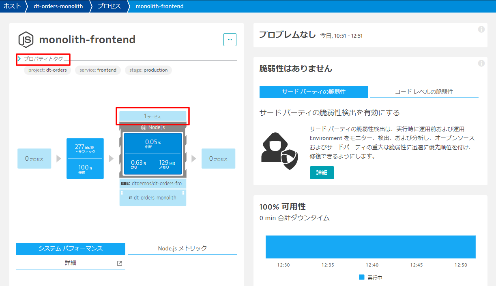

プロセスのページに移動し、このプロセスの情報が表示されるはずです。 以下の画像に従って、以下の場所を探してください：

1. `プロパティとタグ`の行をクリックしてオン/オフを切り替えると、追加のデータが表示されます。コンテナ名なども確認できます。
1. 情報ビュー上で左のプロセスをクリックすると、このプロセスを呼び出しているプロセスが表示されます。
1. 情報ビュー上で、サービスをクリックすると、このプロセスが提供しているサービスが表示されます。複数のサービスを提供している場合は全てのサービスが確認できます。

他にはどのような情報が表示されているでしょうか。普段見ないようなメトリクスを確認することはできますでしょうか。

### 💥 **TECHNICAL NOTE**

重要なことはNode.jsやTomcatのような一般的なプロセスを自動的に認識し、JVMガーベッジコレクションのようなプロセス固有のメトリクスを取得します。サポートしているテクノロジーや言語に関する情報については<a href="https://www.dynatrace.com/support/help/technology-support" target="_blank">公式ドキュメント</a>をご確認ください。

## Dynatraceとコンテナ

サンプルアプリはDockerコンテナとして構築されており、Dynatraceはコンテナにフックし、コンテナ化されたプロセスにOneAgentを注入するためのコードを提供します。

### Dynatraceによるコンテナ監視方法

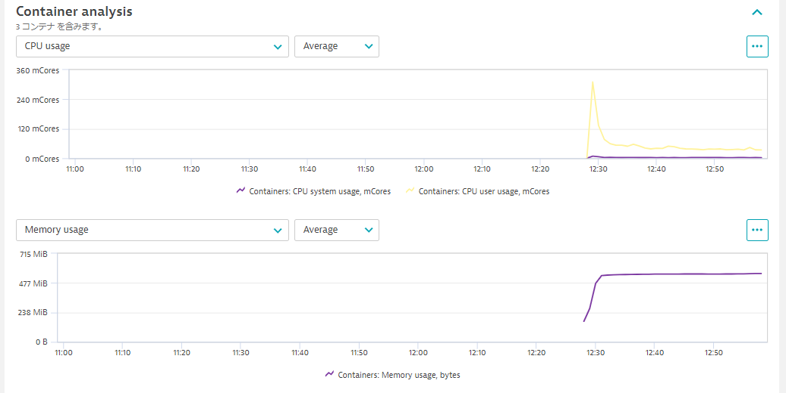

Dockerモニタリングのために、Dockerイメージの変更、実行コマンドの変更、コンテナの追加作成は必要ありません。コンテナ化されたアプリケーションやサービスを提供するホストにOneAgentをインストールするだけです。Dynatraceは、コンテナの作成と終了を自動的に検出し、それらのコンテナ内に含まれるアプリケーションとサービスを監視します。

### 💥 **TECHNICAL NOTE**

より詳細な情報は以下の公式ドキュメントを参照ください。

* <a href="https://www.dynatrace.com/support/help/shortlink/container-platforms-hub" target="_blank">Set up Dynatrace on container platforms</a>
* <a href="https://www.dynatrace.com/support/help/shortlink/container-monitor-hub" target="_blank">Container platform monitoring</a></i>

## サービス

ウェブアプリケーションは、ウェブサーバーやアプリケーションプロセス（Tomcatなど）によって提供されるウェブページで構成されています。ウェブアプリケーションやモバイルアプリケーションは、ウェブリクエスト、ウェブサービス・コール、メッセージングなどのリクエストを処理するサービスの上で構築されています。

このような「サーバーサイド・サービス」は、ウェブサービス、ウェブコンテナ、データベースリクエスト、カスタムサービスなどの形をとります。また、サービスは、他のウェブサービス、メッセージングサービス、データベースなど他のサービスを呼び出し連携してリクエストの処理を行います。

### 👍 どのように役立つのか

移行を計画する際には、ホスト、プロセス、サービス、アプリケーションの観点から、他のアーキテクチャとの相互依存関係を完全に把握することが重要です。時間は常に限られているため、これを一箇所で行うことができれば、評価スケジュールを短縮することができます。

### サービスの確認

それでは、左側のメニューから `アプリケーション オブザーバビリティ > サービス` をクリックして、監視されているサービスを見てみましょう。複数のサービスが動作していることが確認できるはずです。

`frontend`サービスをクリックします。複数ある場合は、`monolith-forntend`と記載がある方を選びます。

サービスページが表示され、この特定のサービスに関する情報が表示されます。

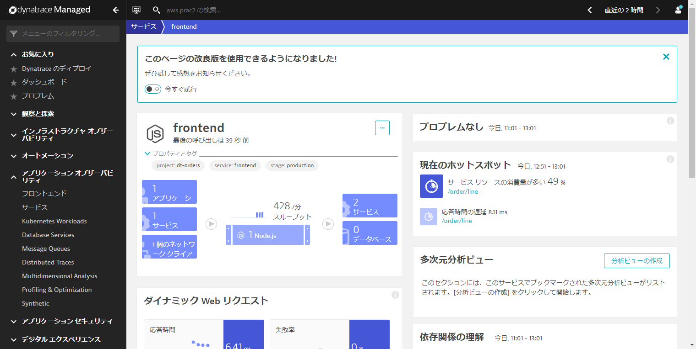

上記ページはクラシックビューとなります。`今すぐ試行`にチェックを入れることでUnified Analysis 画面に切り替えることができます。

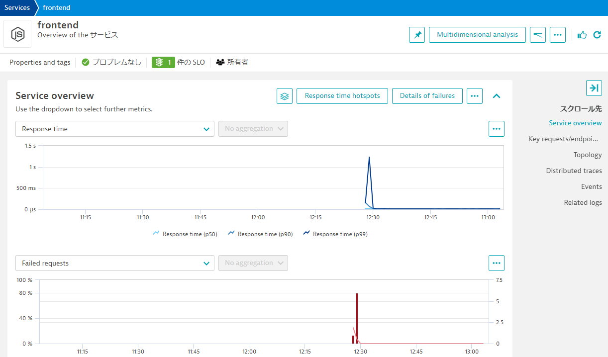

1. `プロパティとタグ`をクリックすることで追加の情報を確認することができます。
1. Service overview画面では応答時間や失敗したリクエストの件数と割合、リクエストの件数を確認することができます。
1. Topologyではこのサービスがどのサービスを呼び出しているのか確認することができます。

1. Distrbuted traces このサービスに関連する分散トレースを確認することができます。
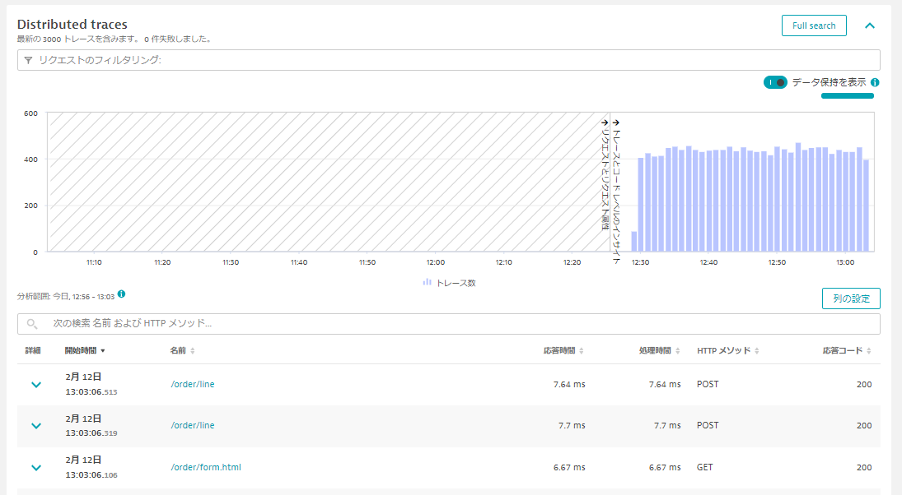

**Key requests/endpoints**セクションにある`View all request details`ボタンをクリックしてリクエストの詳細を確認します。
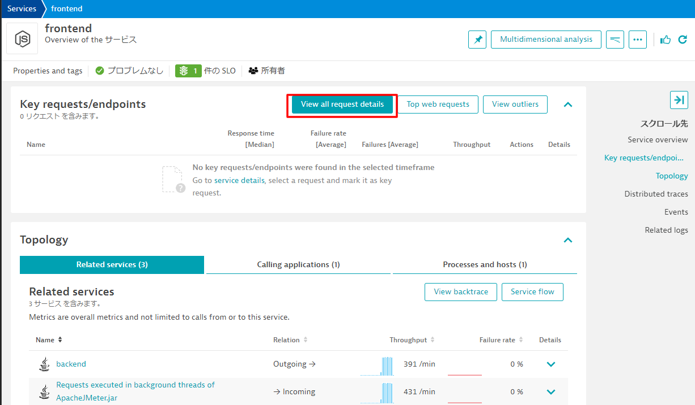

このページでは、上段部分では応答時間や失敗率、リクエストの処理にかかったCPU使用率やスループットを時系列データとして確認ができます。下にスクロールすることで上位のリクエストまたはエンドポイントを確認することができます。

リクエストの一つをクリックすると、時系列チャートはそのリクエストだけにフィルタリングされます。
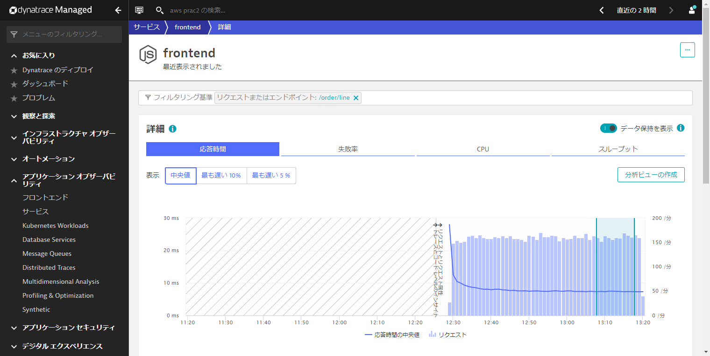

### 多次元分析ビュー

Negative
: リクエストのフィルタリングに`/order/line`が適用されている場合はｘを押してフィルタリングから外しておきます。

リクエストまたはエンドポイントの右側のに`分析ビューの作成`と書かれたボタンがあるので、それをクリックします。
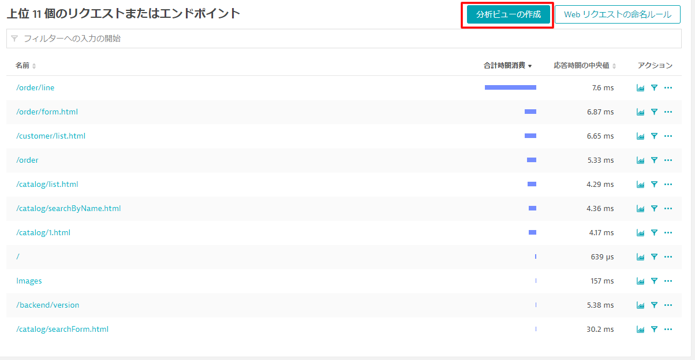

Negative
: 画面上部にも`分析ビューの作成`がありますが、そこではなく下にスクロールした方をクリックしてください。

カスタム多次元分析画面ではデータの表示、フィルタリング、分析に利用できるさまざまなオプションがあります。

例えば、以下のようなビューを確認してみましょう。

* 応答時間の95パーセンタイルを表示してみましょう。
* 応答時間が10ms以上のリクエスト数を表示してみましょう。

他にどのようなことが可能か試してみてください。

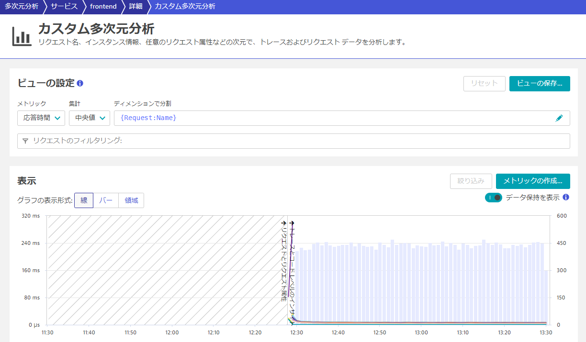

### サービスフロー分析

ホストやプロセス、サービスを確認する1つの方法について見てきましたが、`サービスフロー`と`サービスバックトレース`を使用して、Dynatraceがアプリケーションのトランザクションをエンドツーエンドでどのように理解し、可視化するか見てみましょう。

* `サービスフロー`では、サービスやリクエスト、またはそれらをフィルタリングしたサブセットからのフローを見ることができます。トリガーされた特定のサービスとともに、リクエストの各コンポーネントが全体的なレスポンスタイムにどのように貢献しているかも確認することができます。
* `サービスバックトレース`では、そのサービスがどのように呼ばれているのかを見ることができます。他のどのサービスからどのようにどれぐらい呼び出されているのか確認することができます。

### 👍 どのように役立つのか

通常業務時間中のアクセスの種類、実行されたステートメント、転送されたデータ量を知ることで、移行対象のより良い計画と優先順位付けが可能になります。場合によっては、依存関係が少なく移行が複雑でない他のサービスやデータベースを優先し、依存関係が複雑なデータベースの移行を見送ることもできます。

### サービスフローの確認

1. `frontend`サービスページに戻ります。下記画像の`frontend`をクリックすることで簡単に戻ることができます。

    

1. `frontend`のサービスページで**Topology**の`Service flow`ボタンをクリックします。

    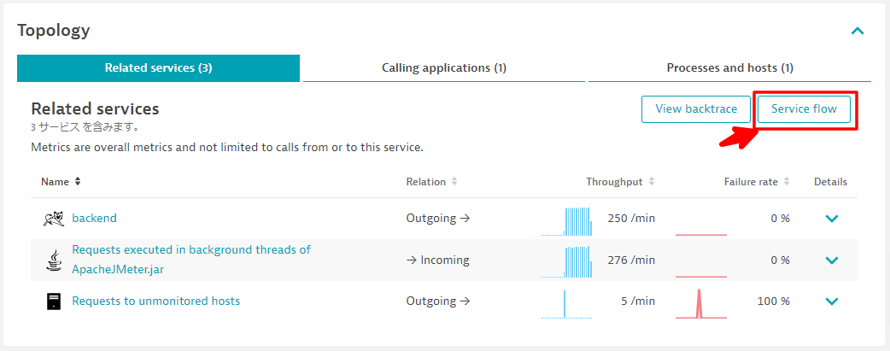

### 応答時間の観点

**サービスフロー**ページに遷移します。

すぐにこのアプリケーションがどのような構造になっているかが分かります。

* `frontend`が`backend`を呼び出している
* `backend`が`[embedded]`(Database)を呼び出している

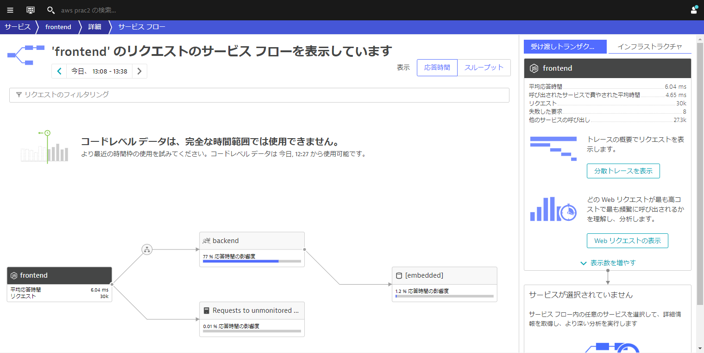

上の画像において：

1. タイムフレームのデフォルトは、グローバルタイムフレームセレクターで設定されているもので、最大24時間です。
1. **応答時間**の観点でデータを表示しています。**スループット**の観点に切り替えることができます。
1. ボックスをクリックすると、応答時間のメトリクスが展開されます。応答時間のほとんどは、バックエンド・サービスに費やされていることがわかります（画像のデータでは応答時間の77%を占めています）。
1. バックエンド・サービスのリクエストごとにデータベースへの呼び出しが数回あるとしても、レスポンスタイムのうちデータベースに費やされるのはごくわずかです。

### スループットの観点

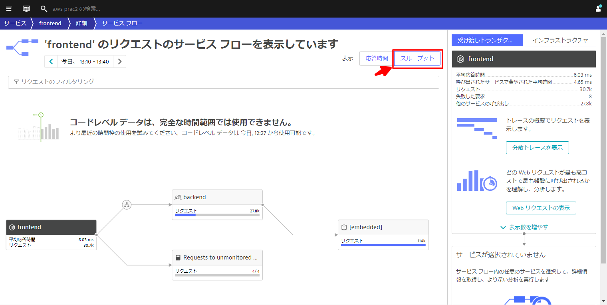

1. ボックスをクリックして、**スループット**視点に変更します。
1. ボックスをクリックしてメトリクスを展開し、バックエンド・サービスへのリクエスト数と平均レスポンスタイムを確認します。
1. `backend`から`database`へのリクエスト数を確認できます。`backend`へのリクエストが約27,800に対して、データベースへのリクエストは114,000と4倍以上になっていることがわかります。

### サービスバックトレース分析

Dynatraceは、アプリケーションのトランザクションをエンドツーエンドで理解します。このトランザクションの洞察は、バックトレースのようにいくつかの方法で可視化されます。

バックトレースツリービューは、ページロードまたはブラウザでのユーザーアクションから始まる、このサービスコールにつながったサービスのシーケンスを表します。

### サービスバックトレースの確認

それでは、左側のメニューの `アプリケーションオブザーバビリティ > サービス` をクリックして、サービス一覧を表示しましょう。
今度は`backend`をクリックします。複数の`backend`がある場合は、monolith-backendを選択します。

`backend`サービス画面で、`バックトレースの表示`ボタンをクリックします。

サービスのバックトレースページで、この特定のサービスの情報を見ることができます。

これは次のラボでもっと面白くなりますが、モノリスバックエンドについては、バックトレースが以下のようになっていることがわかります：

1. スタートのポイントは`backend`になります。
1. `backend`は`frontend`から呼び出されています。
1. `ApacheJMeter.jar`はトラフィックを生成する負荷ツールです。
1. また、`My web application`から**frontend**へのブラウザーのトラフィックが見えるかもしれません。もし表示されなくても問題ありません。

**バックトレース内の行をクリックすると、ページの下部が展開されます。**

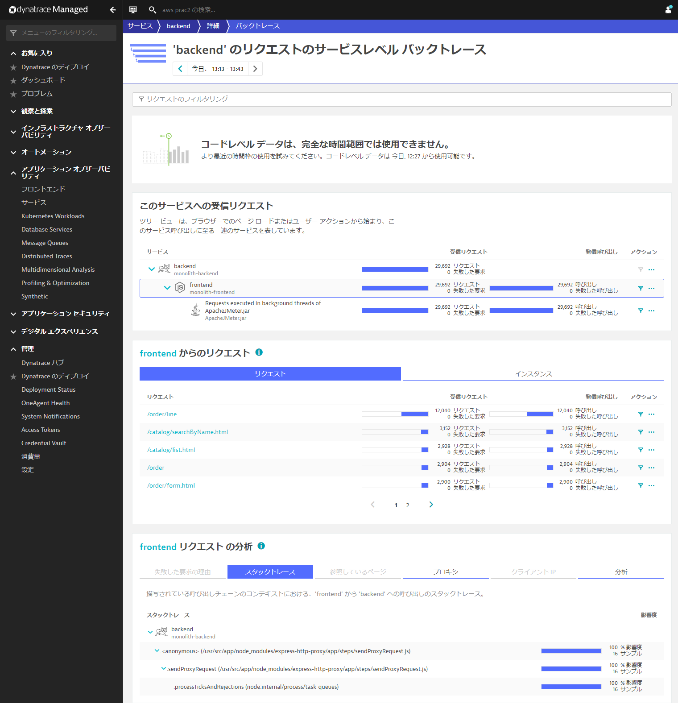

### 👍 どのように役立つのか

サービスフローとサービスバックトレースを使用することで、これら2つのツールは、ホスト、プロセス、サービス、およびアプリケーションの観点から、アーキテクチャの残りの部分との相互依存関係を完全に把握することができます。

## データベース

移行を計画する際、データベースのオブザーバビリティは計画を成功させる上で非常に重要です。通常の運用時間帯におけるアクセスの種類、実行されたステートメント、転送されたデータ量を把握することで、より良い移行計画と移行グループの優先順位付けが可能になります。場合によっては、依存関係が少なく移行が複雑でない他のサービスやデータベースを優先して、このデータベースの移行を見送ることもできます。

### 👍 どのように役立つのか

データベースのアクティビティを監視すると、Dynatraceはどのデータベースステートメントが最も頻繁に実行され、どのステートメントに最も時間がかかっているかを表示します。また、移行計画や移行グループの優先順位付けに直接役立つ、データベースステートメントを実行するサービスも確認できます。

DynatraceはOracleやMicrosoft SQL Server, MySQL, PostgreSQLといった主要なDBMS製品に対応しています。詳しくは<a href="https://www.dynatrace.com/platform/database-monitoring/" target="_blank">Database observability</a>をご参照ください。

### データベースの確認

サンプルアプリケーションに存在するデータベースがDynatraceではどのように見えるのか確認してみましょう。

1. `backend`サービスに戻ります。1つの方法は、左側のメニューの`サービス`に戻って、`backend`サービスを選択することです。
1. `backend`サービスページで、`[embedded]`のデータベースを開きます。
    

サンプルアプリケーションでは<a href="http://hsqldb.org/" target="_blank">HSQLDB</a>を使用しています。このページでは、次のようなデータベースのプロセスを調べることができます。

1. このデータベースを呼び出しているサービス
1. データベースの可用性
1. 個々のSQLステートメント
1. カスタムの多次元分析

画面構成はさきほどまでのサービスビューとほとんど変わらないことが確認できます。`Statement types`からSQLクエリの詳細を確認してみましょう。

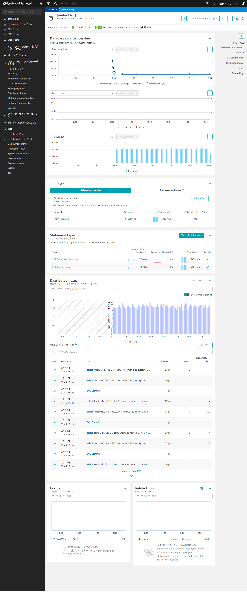

## テクノロジーとプロセス

Dynatraceはデフォルトで、Dynatrace Smartscapeの一部として、FullStackの水平方向（誰が誰と話しているか）と垂直方向（何が何上で実行されているか）の依存関係を可視化します！OneAgentをインストールするだけで、コードの変更も設定変更も必要ありません。

モノリスを構成するプロセスを確認することで把握していなかった依存関係を知ることができます。「5年前に導入したこのレガシー・プロセスへの依存性をすっかり忘れていました。」というのはよく聞く話です。

マイグレーションを計画する際、エコシステムを構成しているテクノロジーを知ることは、特定のサービスをマイグレーションするか、リファクタリングするか、置き換えるかを決める鍵となります。

テクノロジーオーバービューのサンプル画面

### 👍 どのように役立つのか

これもすぐに使える機能で、あなたの環境にどのようなテクノロジーがどの程度存在するかをヒートマップ表示で理解するのに役立ちます。

### テクノロジーとプロセスの確認

1. 左のメニューにある`インフラストラクチャオブザーバビリティ > Technologies & Processes`をクリックすると、OneAgent が自動的に検出しプロセスのテクノロジが表示されます。

    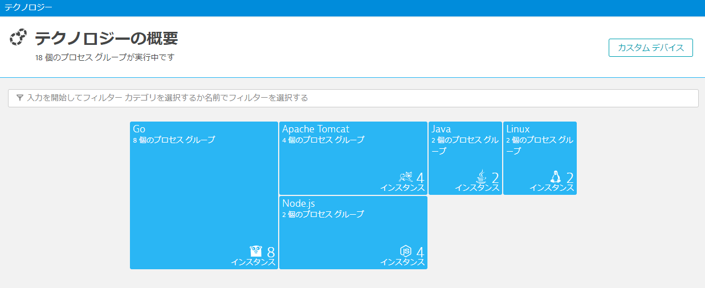

1. フィルターボックスで`タグ`を選び、次に`stage`、`production`を選びます。以下のようにフィルタリングされます。

    

### さらなる機能について

1. 左のメニューにある`管理 > Dynatrace ハブ`をクリックします。

    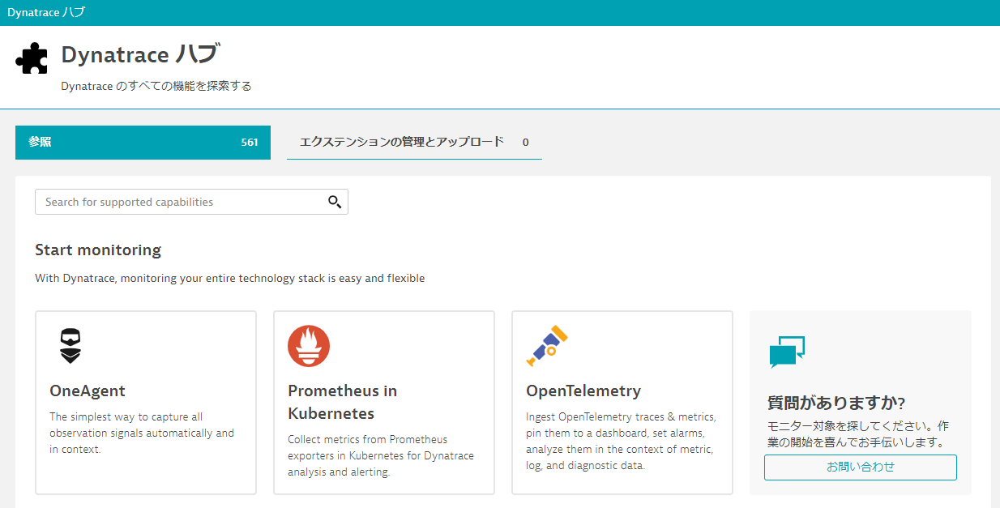

1. **Dynatrace ハブ**ではDynatraceがサポートする多くのテクノロジーについて確認することができます。

このリストは、<a href="https://www.dynatrace.com/hub" target="_blank">Dynatraceウェブサイトのハブページ</a>と同期し、常に更新されます。

## 本セッションのまとめ

OneAgent をインストールするだけで、インフラストラクチャ層とアプリケーション層の両方から、サンプル・アプリケーションの詳細なトポロジー・ビューを得ることができ、必要な答えを持ってクラウドへの導入に取り組む準備が整いました。

* **環境把握と優先順位付け** - サービスやコンポーネントの複雑さと、環境アーキテクチャの他の部分への相互依存性を理解できました。
* **環境の大きさと必要なリソース** - 必要なリソースの消費パターンに沿ってマイグレーションに必要なリソースを理解できました。
* **最適なマイグレーション戦略** - 現在のエンド・ツー・エンドのトランザクションをアーキテクチャを通じて理解し、最適な移行戦略（リホスト、リファクタリング、リアーキテクト、リビルド）を選択できるようになりました。

### チェックリスト

このセクションでは以下を確認しました：

✅ Dynatrace OneAgentが取得したさまざまな情報の確認方法

✅ サンプルアプリケーションに関するトランザクションの流れ

✅ Dynatraceがモダナイゼーションにどのように役立つのか
